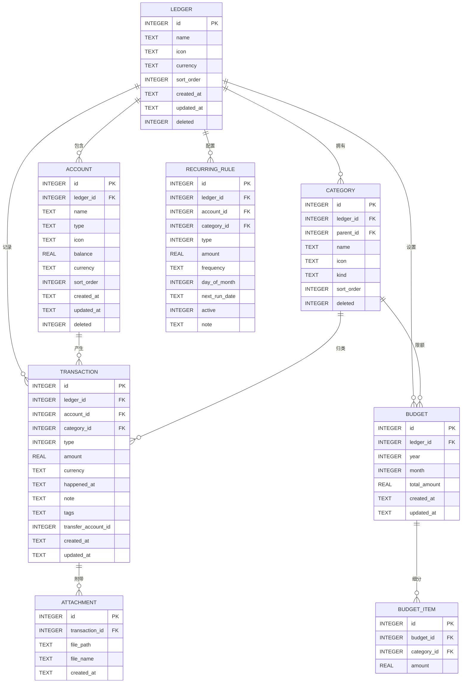

# 个人记账本（MoneyBook）软件开发设计文档

| 文档信息 | 内容 |
| --- | --- |
| 项目名称 | 个人记账本（MoneyBook） |
| 版本 | v1.2（已交付） |
| 编写日期 | 2025 年 |
| 技术形态 | Electron 桌面应用（跨平台，Windows 优先） |
| 架构风格 | 模块化分层架构 + 本地单机部署 |
| 文档状态 | 已交付 |

> 说明：本文档基于以下默认假设编写（用户确认采用默认方案）：
> 1. 纯本地单机版，数据存储在本地 SQLite，不做云端同步；
> 2. 核心功能包含：记账、预算、统计报表、周期性账单、导入导出、多账本、应用锁、自动备份；
> 3. 单用户、支持多账本（生活账 / 旅行账等）；
> 4. 技术栈：Vue 3 + TypeScript + Vite + Electron + electron-builder；
> 5. 界面：侧边栏导航 + 主内容区，支持深/浅色主题。

---

## 目录

1. [项目概述与目标用户](#1-项目概述与目标用户)
2. [核心功能列表（MoSCoW 优先级）](#2-核心功能列表moscow-优先级)
3. [技术选型与理由](#3-技术选型与理由)
4. [数据库设计（ER 图与字段说明）](#4-数据库设计er-图与字段说明)
5. [RESTful API 设计](#5-restful-api-设计)
6. [前端页面结构（路由与组件划分）](#6-前端页面结构路由与组件划分)
7. [非功能性需求](#7-非功能性需求性能安全等)
8. [未来扩展计划](#8-未来扩展计划)

---

## 1. 项目概述与目标用户

### 1.1 项目背景

在个人财务管理领域，市面上主流记账产品多为移动端（随手记、鲨鱼记账等）或纯 Web 端，存在以下痛点：

- 数据托管在云端，隐私泄露风险高；
- 功能臃肿、广告多、引导消费（会员/理财）；
- 桌面端体验缺失，数据难以本地留存与离线操作。

本项目「个人记账本（MoneyBook）」是一款基于 **Electron** 的桌面记账应用，聚焦"**本地、隐私、轻量、可迁移**"四个关键词，让用户拥有完全属于自己的账本数据。

### 1.2 产品定位

- **形态**：跨平台桌面应用（Windows / macOS / Linux），Windows 优先适配；
- **核心价值**：极速记账 + 清晰报表 + 数据 100% 本地可控；
- **数据策略**：本地 SQLite 存储，支持导出/导入与自动备份，数据所有权归用户。

### 1.3 目标用户

| 用户画像 | 特征描述 | 核心诉求 |
| --- | --- | --- |
| 记账新手（18~28 岁） | 刚工作/上学，收支简单 | 打开即记、流程极简、无学习成本 |
| 精打细算族（25~40 岁） | 有稳定收入，关注月度预算 | 预算管控、超支提醒、月度报表 |
| 隐私敏感型用户 | 不愿将财务数据上传云端 | 本地存储、加密、无广告无云 |
| 多场景记账用户 | 需要区分生活/旅行/项目账 | 多账本切换、多币种记录 |

### 1.4 项目目标（SMART）

1. 完成一款可安装、可离线运行的桌面记账应用 MVP；
2. 单条记账耗时 ≤ 10 秒（从打开应用到保存成功）；
3. 支持 10 万条记录的流畅查询与报表渲染（首屏 < 2s）；
4. 提供完善的导入导出（CSV / Excel / JSON）能力，保证数据可迁移；
5. 代码采用模块化分层，便于后续扩展云端同步、多用户等功能。

---

## 2. 核心功能列表（MoSCoW 优先级）

### 2.1 优先级定义

- **Must Have（必须有）**：MVP 版本必须交付，否则产品不可用；
- **Should Have（应该有）**：重要但可延后到第二阶段；
- **Could Have（可以有）**：锦上添花，有资源再做；
- **Won't Have（本次不做）**：明确排除，未来版本考虑。

### 2.2 功能清单

| 编号 | 功能模块 | 功能描述 | 优先级 |
| --- | --- | --- | --- |
| F01 | 账本管理 | 创建/切换/删除多本账本（生活账、旅行账等） | **Must** |
| F02 | 账户管理 | 现金/银行卡/支付宝/微信/信用卡等资金账户，支持余额展示 | **Must** |
| F03 | 记账（支出/收入） | 快速记一笔，支持金额、分类、账户、日期、备注、附件 | **Must** |
| F04 | 分类管理 | 预置支出/收入分类，支持自定义分类与图标 | **Must** |
| F05 | 流水查询 | 按时间/分类/账户/关键词/金额区间筛选，支持分页 | **Must** |
| F06 | 统计报表 | 月度收支汇总、分类占比（饼图）、趋势（折线图）、Top 排行 | **Must** |
| F07 | 数据导入导出 | 导出 CSV / Excel / JSON；支持 CSV / Excel 导入 | **Must** |
| F08 | 本地数据库 | SQLite 持久化，事务保证一致性 | **Must** |
| F09 | 应用锁 | 启动时密码/指纹（Windows Hello）解锁，防止他人查看 | **Should** |
| F10 | 预算管理 | 按月/按分类设置预算，超支提醒 | **Should** |
| F11 | 周期性账单 | 房租/会员等自动生成周期账单（日/周/月/年） | **Should** |
| F12 | 自动备份 | 定时备份数据库到指定目录，保留 N 份 | **Should** |
| F13 | 多币种 | 记账时选择币种，按汇率折算汇总 | **Could** |
| F14 | 标签/场景 | 给流水打标签，支持自定义场景（聚餐、出差等） | **Could** |
| F15 | 借贷记账 | 借出/借入、应收应付管理 | **Could** |
| F16 | 深色主题 | 深/浅色主题切换，跟随系统 | **Could** |
| F17 | 多语言 | 中/英界面切换 | **Won't（v2 考虑）** |
| F18 | 云端同步 | 账号体系、多设备同步 | **Won't（v3 考虑）** |
| F19 | 小部件/快捷入口 | 系统托盘快速记账 | **Won't（v2 考虑）** |

### 2.3 MVP 范围（Must + 部分 Should）

**MVP（v1.0）交付范围**：F01 ~ F08（Must），F10、F11、F12、F16（Should 中选做），F09 应用锁作为 v1.1。

---

## 3. 技术选型与理由

### 3.1 总体技术栈

| 层次 | 技术选型 | 版本建议 | 选型理由 |
| --- | --- | --- | --- |
| 桌面壳 | Electron | ≥ 28 | 跨平台、生态成熟、可直接复用 Web 技术栈 |
| 前端框架 | Vue 3（Composition API） | 3.4+ | 上手快、响应式性能好、社区活跃 |
| 开发语言 | TypeScript | 5.x | 类型安全，降低记账领域模型出错率 |
| 构建工具 | Vite | 5.x | 开发热更新快、构建产物优化好 |
| UI 组件库 | Element Plus（或 Naive UI） | 最新 | 桌面后台型组件齐全（表格/表单/弹窗） |
| 图表库 | ECharts | 5.x | 记账报表（饼图/折线图）场景成熟 |
| 路由 | Vue Router 4 | 4.x | 官方标准路由方案 |
| 状态管理 | Pinia | 2.x | Vue3 官方推荐、轻量、TS 友好 |
| 数据库 | SQLite（better-sqlite3） | 11.x | 本地嵌入式、零配置、单文件、事务强、性能好 |
| ORM/访问层 | Drizzle ORM（或 Knex） | 最新 | TS 类型推导好、迁移管理完善 |
| 密码学 | node:crypto（内置）+ Argon2 | - | 应用锁口令哈希、数据加密 |
| 打包 | electron-builder | 24.x | 支持 NSIS/dmg/AppImage，图标与自动更新 |
| 进程通信 | Electron IPC（contextBridge） | - | 安全沙箱下渲染进程通过预加载脚本通信 |
| 数据校验 | Zod | 3.x | 前后端共享 schema 校验 |

### 3.2 架构分层

采用 **Electron 经典三进程模型 + 前后端分层**：

```
┌────────────────────────────────────────────────────┐
│                 渲染进程 (Renderer)                  │
│  Vue 3 SPA：页面/组件/状态管理/ECharts               │
│  （仅运行 UI 与纯展示逻辑）                           │
├────────────────────────────────────────────────────┤
│              预加载脚本 (Preload)                    │
│  contextBridge 暴露白名单 API：window.moneyBook.*    │
├────────────────────────────────────────────────────┤
│                 主进程 (Main)                        │
│  ┌─────────────┐ ┌─────────────┐ ┌─────────────┐  │
│  │ 窗口管理模块 │ │ IPC 路由模块 │ │ 服务层 Service │  │
│  └─────────────┘ └─────────────┘ └──────┬──────┘  │
│  ┌─────────────┐ ┌─────────────┐ ┌──────┴──────┐  │
│  │ 安全模块     │ │ 备份/导入导出 │ │ 数据访问 DAO  │  │
│  │ (应用锁/加密)│ │ 模块         │ │ (SQLite)     │  │
│  └─────────────┘ └─────────────┘ └─────────────┘  │
└────────────────────────────────────────────────────┘
```

### 3.3 关键选型理由

1. **为什么用 Electron 而非 Tauri / Qt**：用户已明确要求 Electron；Electron 生态（better-sqlite3、electron-builder）对本地数据库与桌面打包支持最成熟，团队若以 Web 技术栈为主则上手成本最低。
2. **为什么用 SQLite 而非 MySQL / 文件**：单机记账数据量（万级~十万级）完全在 SQLite 能力范围内；单文件即数据、零运维、支持事务与索引，配合 `WAL` 模式读写性能优秀；后续如需云同步可直接将 SQLite 作为客户端缓存。
3. **为什么业务逻辑放主进程**：渲染进程只做 UI。所有数据库访问、文件 IO、加解密都收敛在主进程服务层，通过 IPC 调用。这样既规避渲染进程的沙箱限制，也方便未来将服务层抽离为独立 Node 服务做云同步。
4. **为什么用 Drizzle ORM**：记账领域模型（流水、分类、账户）之间有关联查询，ORM 提供类型安全与迁移；比手写 SQL 更易维护，比 Prisma 更轻量（better-sqlite3 同步驱动，无需额外引擎）。
5. **为什么用 contextBridge + IPC 白名单**：开启 `contextIsolation`，渲染进程无法直接访问 Node API，杜绝 XSS 导致的本机数据泄露，符合安全基线。

### 3.4 目录结构（模块化）

```
application-money/
├── electron/
│   ├── main/                      # 主进程
│   │   ├── index.ts               # 入口，创建窗口
│   │   ├── ipc/                   # IPC 路由（按领域拆分）
│   │   │   ├── transaction.ipc.ts
│   │   │   ├── account.ipc.ts
│   │   │   ├── category.ipc.ts
│   │   │   ├── budget.ipc.ts
│   │   │   ├── ledger.ipc.ts
│   │   │   ├── report.ipc.ts
│   │   │   └── system.ipc.ts      # 备份/导入导出/应用锁
│   │   ├── services/              # 服务层（业务逻辑）
│   │   │   ├── transaction.service.ts
│   │   │   ├── account.service.ts
│   │   │   ├── budget.service.ts
│   │   │   ├── report.service.ts
│   │   │   ├── backup.service.ts
│   │   │   ├── importer.service.ts
│   │   │   └── security.service.ts
│   │   ├── db/                    # 数据访问层
│   │   │   ├── database.ts        # SQLite 连接与迁移
│   │   │   ├── schema.ts          # Drizzle 表定义
│   │   │   └── repositories/      # DAO
│   │   ├── utils/
│   │   └── config/
│   ├── preload/
│   │   └── index.ts               # contextBridge 暴露 window.moneyBook
│   └── shared/                    # 前后端共享类型/IPC 协议定义
├── src/                           # 渲染进程（Vue3）
│   ├── main.ts
│   ├── App.vue
│   ├── router/
│   ├── stores/
│   ├── views/
│   ├── components/
│   ├── composables/
│   ├── styles/
│   └── types/
├── resources/                     # 图标、安装包资源
├── tests/
├── package.json
├── electron-builder.yml
└── vite.config.ts
```

---

## 4. 数据库设计（ER 图与字段说明）

### 4.1 ER 图

以下为 Mermaid ER 图（可渲染于支持 Mermaid 的编辑器/文档平台）：



### 4.2 表结构与字段说明

> 约定：所有表使用 `INTEGER PRIMARY KEY AUTOINCREMENT` 自增主键；时间字段统一存 `TEXT`（ISO8601，本地时区）；金额字段存 `REAL`（分单位精度说明见 4.3）；软删除使用 `deleted INTEGER DEFAULT 0`。

#### 4.2.1 ledger（账本表）

| 字段 | 类型 | 必填 | 说明 |
| --- | --- | --- | --- |
| id | INTEGER PK | 是 | 账本 ID |
| name | TEXT | 是 | 账本名称（如"生活账"） |
| icon | TEXT | 否 | 账本图标标识 |
| currency | TEXT | 是 | 默认币种（如 CNY/USD），默认 CNY |
| sort_order | INTEGER | 否 | 排序权重 |
| created_at | TEXT | 是 | 创建时间 |
| updated_at | TEXT | 是 | 更新时间 |
| deleted | INTEGER | 否 | 0=正常，1=已删除（软删除） |

#### 4.2.2 account（资金账户表）

| 字段 | 类型 | 必填 | 说明 |
| --- | --- | --- | --- |
| id | INTEGER PK | 是 | 账户 ID |
| ledger_id | INTEGER FK | 是 | 所属账本 |
| name | TEXT | 是 | 账户名（现金/招行卡/支付宝） |
| type | TEXT | 是 | 类型：cash / bank_card / credit_card / alipay / wechat / other |
| icon | TEXT | 否 | 图标标识 |
| balance | REAL | 是 | 当前余额（由流水累计维护或手动修正） |
| currency | TEXT | 是 | 账户币种 |
| sort_order | INTEGER | 否 | 排序 |
| created_at / updated_at | TEXT | 是 | 时间戳 |
| deleted | INTEGER | 否 | 软删除 |

#### 4.2.3 category（分类表）

| 字段 | 类型 | 必填 | 说明 |
| --- | --- | --- | --- |
| id | INTEGER PK | 是 | 分类 ID |
| ledger_id | INTEGER FK | 是 | 所属账本 |
| parent_id | INTEGER FK | 否 | 父分类 ID（支持二级分类，NULL 为一级） |
| name | TEXT | 是 | 分类名（餐饮/交通/工资…） |
| icon | TEXT | 否 | 图标 |
| kind | TEXT | 是 | expense=支出 / income=收入 |
| sort_order | INTEGER | 否 | 排序 |
| deleted | INTEGER | 否 | 软删除 |

预置支出分类：餐饮、交通、购物、居住、娱乐、医疗、教育、人情、其他；
预置收入分类：工资、奖金、理财、兼职、其他。

#### 4.2.4 transaction（流水表）★ 核心表

| 字段 | 类型 | 必填 | 说明 |
| --- | --- | --- | --- |
| id | INTEGER PK | 是 | 流水 ID |
| ledger_id | INTEGER FK | 是 | 所属账本 |
| account_id | INTEGER FK | 是 | 关联账户 |
| category_id | INTEGER FK | 否 | 关联分类（转账/调账可为空） |
| type | INTEGER | 是 | 1=支出，2=收入，3=转账，4=调账 |
| amount | REAL | 是 | 金额（>0，正数存储） |
| currency | TEXT | 是 | 币种 |
| happened_at | TEXT | 是 | 发生时间（记账日期时间） |
| note | TEXT | 否 | 备注 |
| tags | TEXT | 否 | 标签，JSON 数组字符串，如 `["聚餐","同事"]` |
| transfer_account_id | INTEGER | 否 | 转账目标账户（type=3 时必填） |
| created_at / updated_at | TEXT | 是 | 系统时间戳 |

> 核心约束：`type=1` 支出时 `account_id` 为扣款账户；`type=2` 收入时 `account_id` 为入账账户；`type=3` 转账为一条记录两个账户同时变化（或拆两条关联记录，实现上二选一，推荐单条 + transfer_account_id，主进程事务内更新两个账户余额）。

#### 4.2.5 budget（预算表）与 budget_item（预算明细表）

**budget**

| 字段 | 类型 | 必填 | 说明 |
| --- | --- | --- | --- |
| id | INTEGER PK | 是 | 预算 ID |
| ledger_id | INTEGER FK | 是 | 所属账本 |
| year / month | INTEGER | 是 | 预算周期（2025 / 6） |
| total_amount | REAL | 是 | 总预算金额 |
| created_at / updated_at | TEXT | 是 | 时间戳 |

**budget_item**

| 字段 | 类型 | 必填 | 说明 |
| --- | --- | --- | --- |
| id | INTEGER PK | 是 | 明细 ID |
| budget_id | INTEGER FK | 是 | 所属预算 |
| category_id | INTEGER FK | 是 | 分类 |
| amount | REAL | 是 | 该分类预算金额 |

> 预算使用：按"预算周期内、该分类下 type=1 支出的总和"计算已用额度；支持设置阈值（如 80%）触发提醒。

#### 4.2.6 recurring_rule（周期性账单规则表）

| 字段 | 类型 | 必填 | 说明 |
| --- | --- | --- | --- |
| id | INTEGER PK | 是 | 规则 ID |
| ledger_id | INTEGER FK | 是 | 所属账本 |
| account_id | INTEGER FK | 是 | 扣款账户 |
| category_id | INTEGER FK | 是 | 分类 |
| type | INTEGER | 是 | 1=支出，2=收入 |
| amount | REAL | 是 | 金额 |
| frequency | TEXT | 是 | daily / weekly / monthly / yearly |
| day_of_month | INTEGER | 否 | monthly 时生效，几号执行 |
| next_run_date | TEXT | 是 | 下次生成日期 |
| active | INTEGER | 否 | 0=停用，1=启用 |
| note | TEXT | 否 | 备注 |

> 处理策略：应用启动 / 每日定时检查 `next_run_date <= today`，在主进程事务中批量生成流水并推进 `next_run_date`。

#### 4.2.7 attachment（附件表）

| 字段 | 类型 | 必填 | 说明 |
| --- | --- | --- | --- |
| id | INTEGER PK | 是 | 附件 ID |
| transaction_id | INTEGER FK | 是 | 关联流水 |
| file_path | TEXT | 是 | 文件在数据目录中的相对路径 |
| file_name | TEXT | 是 | 原始文件名 |
| created_at | TEXT | 是 | 时间戳 |

#### 4.2.8 settings（应用设置表，key-value）

| 字段 | 类型 | 说明 |
| --- | --- | --- |
| key | TEXT PK | 配置键（app_lock_enabled、theme、backup_dir、last_ledger_id…） |
| value | TEXT | 配置值（JSON 字符串） |

#### 4.2.9 索引设计

| 表 | 索引 | 目的 |
| --- | --- | --- |
| transaction | `idx_txn_ledger_time (ledger_id, happened_at DESC)` | 流水列表/报表按月查询 |
| transaction | `idx_txn_account (account_id)` | 账户明细查询 |
| transaction | `idx_txn_category (category_id, happened_at)` | 分类汇总统计 |
| budget | `idx_budget_period (ledger_id, year, month)` | 月度预算查询 |
| account / category | `idx_ledger (ledger_id)` | 账本维度筛选 |

### 4.3 金额精度约定

- 数据库中金额以 **REAL（元）** 存储便于阅读与计算；
- 涉及除法/百分比（如报表占比）时在应用层用 `toFixed(2)` 四舍五入；
- 对精度有强要求的场景（后续多币种汇率折算），升级方案为**金额按"分"存 INTEGER**，本文档 v1.0 采用 REAL + 应用层规整，并在未来扩展计划中标注升级路径。

### 4.4 迁移与初始化

- 使用 Drizzle Kit 生成迁移脚本，`electron/main/db/database.ts` 启动时执行 `migrate()`；
- 首次启动自动创建数据库文件与预置分类数据；
- 数据库文件默认位置：`app.getPath('userData')/moneybook.db`（Windows 为 `%APPDATA%/MoneyBook`）。

---

## 5. RESTful API 设计

### 5.1 设计说明

由于是 Electron 本地应用，实际调用通过 **IPC（主进程路由）** 完成。为保持接口契约清晰、并为未来云同步做铺垫，API 按 **REST 风格资源模型**设计：每个"接口"对应一组 IPC channel（`channel + payload + response`），语义与 REST 一致。约定如下：

- 资源：`/api/v1/xxx`（IPC channel 名：`moneybook:xxx:action`）；
- 请求/响应体统一 JSON；
- 统一响应结构：

```json
{
  "code": 0,            // 0 成功，非 0 业务错误码
  "message": "ok",
  "data": { }
}
```

- 错误码约定：`400` 参数错误、`401` 未解锁/无权限、`404` 资源不存在、`409` 冲突（如重复账本名）、`500` 内部错误。

### 5.2 接口清单（12 个核心接口）

| # | 方法 | 路径 | 说明 | 是否 MVP |
| --- | --- | --- | --- | --- |
| 1 | GET | `/api/v1/transactions` | 分页查询流水（多条件筛选） | ✅ |
| 2 | POST | `/api/v1/transactions` | 新增一笔流水（记账） | ✅ |
| 3 | PUT | `/api/v1/transactions/:id` | 修改流水 | ✅ |
| 4 | DELETE | `/api/v1/transactions/:id` | 删除流水 | ✅ |
| 5 | GET | `/api/v1/reports/summary?month=2025-06` | 月度收支汇总 + 分类占比 + 趋势 | ✅ |
| 6 | GET | `/api/v1/accounts` | 账户列表（含余额） | ✅ |
| 7 | POST | `/api/v1/accounts` | 新增账户 | ✅ |
| 8 | GET | `/api/v1/categories?kind=expense` | 分类列表（树形） | ✅ |
| 9 | GET | `/api/v1/budgets?year=2025&month=6` | 查询月度预算及使用情况 | ✅（v1.1） |
| 10 | PUT | `/api/v1/budgets` | 保存/更新预算 | ✅（v1.1） |
| 11 | POST | `/api/v1/system/backup` | 手动备份数据库 | ✅ |
| 12 | GET | `/api/v1/system/export?format=csv` | 导出流水（csv/excel/json） | ✅ |

> 补充（v1.1+ 再开放）：`/api/v1/recurring-rules`（周期账单 CRUD）、`/api/v1/ledgers`（账本 CRUD）、`/api/v1/security/lock`（应用锁）。

### 5.3 接口详细定义（示例 4 个）

#### 5.3.1 GET /api/v1/transactions（流水列表）

请求 Query 参数：

| 参数 | 类型 | 必填 | 说明 |
| --- | --- | --- | --- |
| ledger_id | number | 是 | 账本 ID |
| account_id | number | 否 | 按账户筛选 |
| category_id | number | 否 | 按分类筛选 |
| type | number | 否 | 1 支出 / 2 收入 / 3 转账 |
| start_date / end_date | string | 否 | 时间范围 `YYYY-MM-DD` |
| keyword | string | 否 | 备注模糊搜索 |
| page / page_size | number | 否 | 分页，默认 1 / 20 |

响应示例：

```json
{
  "code": 0,
  "message": "ok",
  "data": {
    "total": 128,
    "page": 1,
    "page_size": 20,
    "items": [
      {
        "id": 1001,
        "type": 1,
        "amount": 35.50,
        "currency": "CNY",
        "happened_at": "2025-06-12 12:30:00",
        "note": "午餐",
        "account": { "id": 3, "name": "支付宝" },
        "category": { "id": 2, "name": "餐饮", "icon": "🍜" }
      }
    ]
  }
}
```

#### 5.3.2 POST /api/v1/transactions（新增流水）

请求体：

```json
{
  "ledger_id": 1,
  "account_id": 3,
  "category_id": 2,
  "type": 1,
  "amount": 35.50,
  "currency": "CNY",
  "happened_at": "2025-06-12 12:30:00",
  "note": "午餐",
  "tags": ["聚餐"]
}
```

业务规则（主进程事务内保证）：
1. 校验分类 kind 与 type 一致（支出必须选支出分类）；
2. 插入流水；
3. 更新账户余额：`type=1` → `balance -= amount`；`type=2` → `balance += amount`；`type=3` → 源账户减、目标账户加；
4. 返回新流水完整对象。

#### 5.3.3 PUT /api/v1/transactions/:id（修改流水）

- 请求体同 POST；主进程在事务内"撤销旧流水余额影响 → 应用新流水余额影响"，保证余额一致；
- 软删除场景：`DELETE` 同样先回滚余额，再标记 `deleted=1`（或物理删除，按 v1.0 采用物理删除 + 附件清理）。

#### 5.3.4 GET /api/v1/reports/summary（报表汇总）

请求：`GET /api/v1/reports/summary?ledger_id=1&month=2025-06`

响应示例：

```json
{
  "code": 0,
  "message": "ok",
  "data": {
    "month": "2025-06",
    "income_total": 15800.00,
    "expense_total": 6320.50,
    "balance": 9479.50,
    "by_category": [
      { "category_id": 2, "name": "餐饮", "amount": 1560.00, "percent": 24.7 }
    ],
    "daily_trend": [
      { "date": "2025-06-01", "income": 0, "expense": 120.00 }
    ],
    "top_accounts": [
      { "account_id": 3, "name": "支付宝", "amount": 2800.00 }
    ]
  }
}
```

### 5.4 IPC 封装示例（代码片段）

`electron/preload/index.ts`：

```ts
import { contextBridge, ipcRenderer } from 'electron';

const invoke = <T>(channel: string, payload?: unknown): Promise<T> =>
  ipcRenderer.invoke(channel, payload);

contextBridge.exposeInMainWorld('moneyBook', {
  transactions: {
    list: (query) => invoke('moneybook:transaction:list', query),
    create: (data) => invoke('moneybook:transaction:create', data),
    update: (id, data) => invoke('moneybook:transaction:update', { id, data }),
    remove: (id) => invoke('moneybook:transaction:delete', { id }),
  },
  reports: {
    summary: (query) => invoke('moneybook:report:summary', query),
  },
  accounts: {
    list: (ledgerId) => invoke('moneybook:account:list', { ledger_id: ledgerId }),
    create: (data) => invoke('moneybook:account:create', data),
  },
  categories: {
    list: (query) => invoke('moneybook:category:list', query),
  },
  budgets: {
    get: (query) => invoke('moneybook:budget:get', query),
    save: (data) => invoke('moneybook:budget:save', data),
  },
  system: {
    backup: () => invoke('moneybook:system:backup'),
    export: (query) => invoke('moneybook:system:export', query),
  },
});
```

---

## 6. 前端页面结构（路由与组件划分）

### 6.1 路由表

| 路由路径 | 页面 | 说明 | 访问控制 |
| --- | --- | --- | --- |
| `/` | 启动页/重定向 | 未解锁 → 锁屏页；已解锁 → `/dashboard` | - |
| `/lock` | 锁屏页 LockScreen | 应用锁（密码 / Windows Hello） | 未解锁可访问 |
| `/dashboard` | 概览页 Dashboard | 本月收支、余额、预算进度、最近流水 | 需解锁 |
| `/transactions` | 流水列表页 Transactions | 筛选、分页、批量操作、快捷记账入口 | 需解锁 |
| `/transactions/new` | 记账页 TransactionEditor | 新建/编辑一笔（弹窗或独立页） | 需解锁 |
| `/reports` | 统计报表页 Reports | 月度汇总、分类饼图、趋势折线、Top 排行 | 需解锁 |
| `/budgets` | 预算管理页 Budgets | 月度预算设置与进度 | 需解锁 |
| `/accounts` | 账户管理页 Accounts | 账户 CRUD 与余额 | 需解锁 |
| `/categories` | 分类管理页 Categories | 自定义分类 | 需解锁 |
| `/recurring` | 周期账单页 Recurring | 周期规则列表 | 需解锁 |
| `/ledgers` | 账本管理页 Ledgers | 账本切换/创建 | 需解锁 |
| `/settings` | 设置页 Settings | 主题、备份、导入导出、应用锁 | 需解锁 |
| `/:pathMatch(.*)*` | 404 页 | 未匹配路由 | - |

### 6.2 组件划分（模块化）

```
src/components/
├── layout/
│   ├── AppLayout.vue        # 整体布局：侧边栏 + 顶栏 + 内容区
│   ├── SideNav.vue          # 侧边导航（路由菜单 + 账本切换）
│   ├── TopBar.vue           # 顶栏（搜索、主题切换、锁屏、设置入口）
│   └── StatusBar.vue        # 底部状态栏（同步/备份状态）
├── common/                  # 通用基础组件
│   ├── MoneyInput.vue       # 金额输入（千分位、自动 .00）
│   ├── CategoryPicker.vue   # 分类选择器（图标网格）
│   ├── AccountPicker.vue    # 账户选择器
│   ├── DatePicker.vue       # 日期/时间选择
│   ├── EmptyState.vue
│   └── ConfirmDialog.vue
├── transaction/
│   ├── TransactionTable.vue # 流水表格（虚拟滚动）
│   ├── TransactionForm.vue  # 记账表单
│   ├── TransactionFilter.vue# 筛选栏
│   └── TransactionDetail.vue# 详情抽屉
├── report/
│   ├── SummaryCards.vue     # 收入/支出/结余卡片
│   ├── CategoryPieChart.vue # ECharts 饼图
│   ├── TrendLineChart.vue   # ECharts 折线图
│   └── TopList.vue          # 分类/账户排行
├── budget/
│   ├── BudgetProgress.vue   # 预算进度条（超支红色）
│   └── BudgetEditor.vue
├── account/
│   └── AccountCard.vue      # 账户卡片（余额）
└── settings/
    ├── BackupPanel.vue
    ├── ImportExportPanel.vue
    └── SecurityPanel.vue
```

### 6.3 关键页面交互说明

1. **记账页（核心路径）**：快捷键 `Ctrl+N` 全局唤起记账浮层；默认带出上次使用的分类/账户；金额键盘自动聚焦；回车保存。目标：单笔 ≤ 10 秒。
2. **流水列表**：支持按月份分组展示、上下键切换、右键菜单（编辑/删除/复制一笔）；列表使用虚拟滚动保证 10 万条流畅。
3. **报表页**：顶部月份切换器（前后月箭头）；ECharts 图表随窗口大小自适应；点击饼图扇区可下钻到该分类流水。
4. **锁屏**：应用锁开启后，窗口失焦/最小化恢复或启动时进入锁屏；通过主进程校验口令后放行（见 7.2 安全）。

### 6.4 状态管理（Pinia）设计

| Store | 职责 |
| --- | --- |
| `useLedgerStore` | 当前账本、账本列表 |
| `useTransactionStore` | 流水列表缓存、筛选条件、分页 |
| `useAccountStore` | 账户列表与余额 |
| `useCategoryStore` | 分类树（按账本） |
| `useBudgetStore` | 当前月预算与使用情况 |
| `useSettingsStore` | 主题、备份配置、应用锁状态 |
| `useReportStore` | 报表数据与加载状态 |

### 6.5 主题与视觉

- 侧边栏布局：左侧 220px 导航（图标+文字），右侧主内容区；
- 支持浅色/深色/跟随系统（`nativeTheme` 联动 CSS 变量）；
- 设计基调：极简、数据优先，主色为蓝绿系（体现"清清爽爽记账"）。

---

## 7. 非功能性需求（性能、安全等）

### 7.1 性能需求

| 指标 | 目标值 | 验证方式 |
| --- | --- | --- |
| 应用冷启动 | ≤ 2.5s（从点击图标到界面可用） | 启动计时埋点 |
| 单笔记账保存 | ≤ 300ms（本地事务） | 性能测试 |
| 流水列表首屏（10 万条库） | ≤ 2s，滚动 60fps | 虚拟滚动 + 分页 |
| 月度报表生成 | ≤ 1s | SQL 聚合 + 索引 |
| 内存占用 | 空闲 ≤ 300MB，峰值 ≤ 500MB | 任务管理器/Profiler |
| 自动备份耗时 | ≤ 5s（10 万条库） | 备份压测 |

### 7.2 安全需求

| 类别 | 措施 |
| --- | --- |
| 进程隔离 | 开启 `contextIsolation: true`、`nodeIntegration: false`、`sandbox: true` |
| IPC 安全 | 预加载脚本白名单 API；主进程对每个 channel 做 payload 校验（Zod） |
| 应用锁 | 口令使用 **Argon2id** 加盐哈希存储；连续输错 5 次锁定 60s；可选 Windows Hello 生物识别 |
| 数据加密 | 敏感设置（口令哈希）独立存储；可选开启数据库文件整体加密（AES-256-GCM，密钥存系统钥匙串 keytar） |
| XSS 防护 | Vue 默认转义；附件文件名白名单校验；禁止渲染进程拼接可执行内容 |
| 路径安全 | 导入/导出/备份路径统一收敛在主进程，校验 `path.resolve` 防目录穿越 |
| 更新安全 | electron-updater 使用官方发布源 + 校验签名 |

### 7.3 可靠性需求

- SQLite 开启 `WAL` 模式 + `busy_timeout`，写事务失败自动回滚；
- 每次记账写入均在事务内完成（流水 + 余额），保证数据一致性；
- 自动备份：每日（可配置）将数据库文件复制到 `backup_dir`，保留最近 10 份；
- 数据库文件损坏时：启动自检（`PRAGMA integrity_check`），检测到损坏自动提示并从最近备份恢复。

### 7.4 可用性/易用性需求

- 全程键盘可操作：记账快捷键、Tab 导航、回车提交；
- 无网络也能完整使用（纯本地）；
- 空数据引导：首次启动提供"快速上手"与示例数据导入；
- 交互反馈：保存成功 toast、删除二次确认、导入预览确认。

### 7.5 兼容性需求

- Windows 10/11（x64）为第一优先级；macOS 12+、Linux（AppImage）尽力兼容；
- 高分屏（DPI 缩放）适配；
- Electron 自动更新（electron-updater），Windows 用 NSIS 安装包。

### 7.6 可维护性需求

- 模块化分层（UI / IPC / Service / DAO），单测与集成测试覆盖服务层；
- 统一 lint（ESLint + Prettier）、提交规范（Commitlint）；
- 文档：本设计文档 + API 文档（OpenAPI 风格）+ 数据库迁移记录。

---

## 8. 未来扩展计划

### 8.1 版本路线图

| 版本 | 主题 | 主要新增 | 状态 |
| --- | --- | --- | --- |
| v1.0（MVP） | 本地记账核心 | 记账、账户、分类、流水、报表、导入导出、多账本 | ✅ 已交付 |
| v1.1 | 财务管控 | 应用锁、预算、周期账单、自动备份、深色主题 | ✅ 已交付 |
| v1.2 | 体验增强 | 多币种+汇率、标签/场景、系统托盘快捷记账、更多报表维度 | ✅ 已交付 |
| v2.0 | 数据连通 | 银行卡/支付宝账单 CSV 智能导入（模板映射）、数据可视化大屏 | ⏳ 规划中 |
| v3.0 | 云同步 | 账号体系、端到端加密云同步、Web 端/Mobile 端 | ⏳ 规划中 |
| v4.0 | 智能 | AI 账单分类、月度消费洞察报告、异常消费提醒 | ⏳ 规划中 |

### 8.2 扩展性设计预留

1. **服务层可抽离**：主进程 Service 层与 IPC 解耦，未来云同步时可将 Service 复用于服务端，仅替换存储层；
2. **金额精度升级**：由 REAL（元）升级为 INTEGER（分）+ 汇率表 `exchange_rate`，报表层统一换算；
3. **多用户/多设备**：新增 `user` 表与同步游标（`sync_cursor`），SQLite 作为本地缓存，与远端 PostgreSQL 做增量同步；
4. **插件机制**（远期）：通过 IPC 白名单扩展自定义报表/导入模板；
5. **PWA/移动端**：渲染层（Vue3）已与桌面壳解耦，未来可复用同一套 UI 逻辑打包为 Web 应用。

### 8.3 风险与应对

| 风险 | 影响 | 应对 |
| --- | --- | --- |
| better-sqlite3 原生模块与 Electron ABI 不兼容 | 打包失败 | 使用 electron-rebuild 自动重编译；固定 Electron 版本 |
| 数据损坏导致用户数据丢失 | 信任危机 | 自动备份 + 完整性自检 + 恢复向导 |
| 大报表渲染卡顿 | 体验下降 | 服务端聚合 + 前端虚拟滚动 + 图表懒加载 |
| 应用锁口令遗忘 | 无法进入 | 提供"忘记密码"通过备份恢复流程（重设口令需验证本地文件所有权） |

---

## 附录 A：MVP 里程碑拆分

| 阶段 | 周期（参考） | 交付物 |
| --- | --- | --- |
| M1 工程搭建 | 1 周 | Electron+Vue3 骨架、目录分层、SQLite 连接与迁移、CI |
| M2 数据层 | 1 周 | 全部表结构、DAO、单元测试 |
| M3 记账闭环 | 1.5 周 | 记账/流水列表/账户/分类，IPC 全链路 |
| M4 报表 | 1 周 | 月度汇总、饼图/折线图 |
| M5 导入导出与备份 | 1 周 | CSV/Excel/JSON 导入导出、自动备份 |
| M6 打磨 | 1 周 | 主题、快捷键、性能优化、安装包产出 |
| 合计 | ≈ 6.5 周 | v1.0 MVP 可交付 |

---

*文档完 — 个人记账本（MoneyBook）设计文档 v1.0*
